# MIT IEEE Undergraduate Research Technology Conference 2022

I attended MIT [URTC](https://urtc.mit.edu/) 2022 during 11th grade and presented my poster titled:  
**FlowVIZ: An Application for Flow Visualization**

Here is the [Poster Presentation Session Schedule](https://urtc.mit.edu/urtc_2022_poster_presentation_schedule.pdf)

## Poster

# Abstract

Flow research plays an important role in the field of engineering including aircraft, car, and submarine design. One of the most important elements in fluid flow research is flow visualization (to display movement of transparent particles), and the most common way to realize flow visualization, either 2D or 3D, is to generate a vector field and calculate the combined force within the spaces. In addition to research and engineering, flow fields are also great tools for generative art. FlowVIZ is an application we developed that focuses on generating and visualizing the movement of particles within a canvas space. The application allows users to draw, rotate, and randomize vectors to create a unique flow field with customized visual effect. FlowVIZ displays in three modes (Edit, Preview, and Time-lapse) and allows real-time modification of vectors to adjust flow patterns by a simple drag to draw system. Users can easily create static or video results to be incorporated into generative art works or other visual works such as websites and films.

## Effects Gallery (click to see video)

[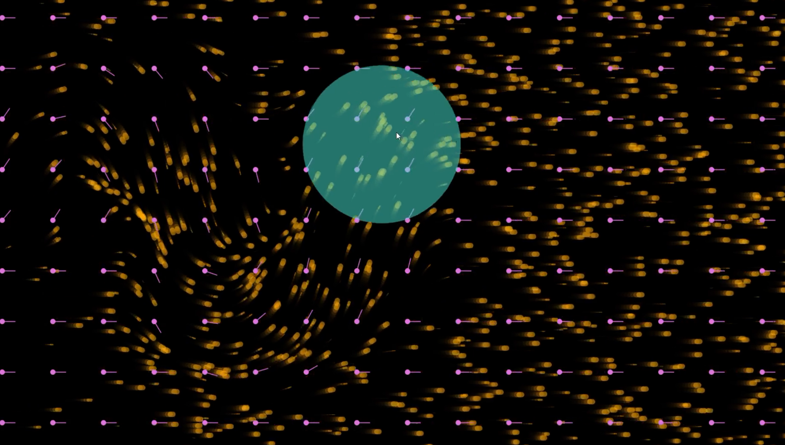](https://youtu.be/E-KIx5bCXTs)

|| [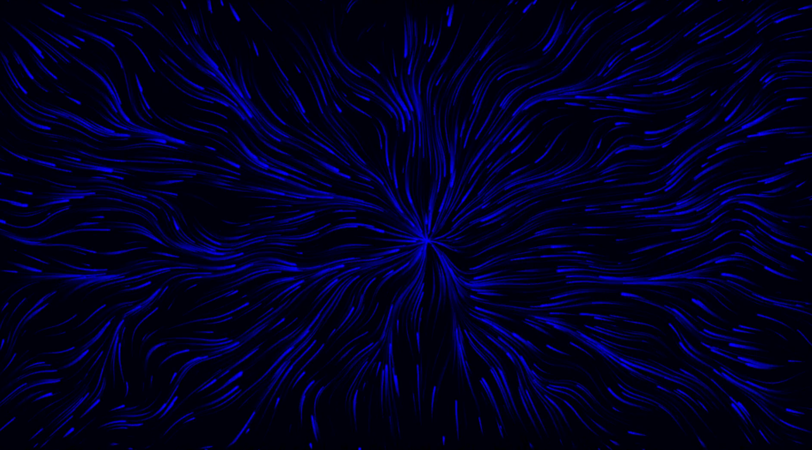](https://youtu.be/NruTmeQxeBk)|
|-|-|
|[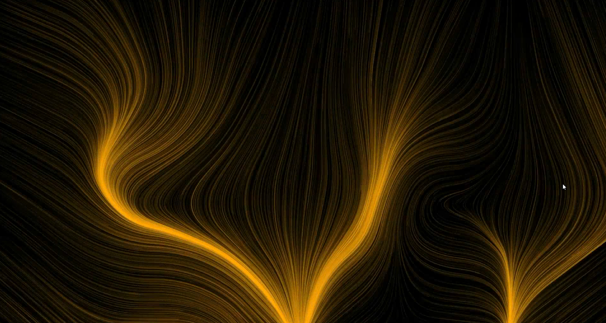](https://youtu.be/tT6J6Lz9z5E) | [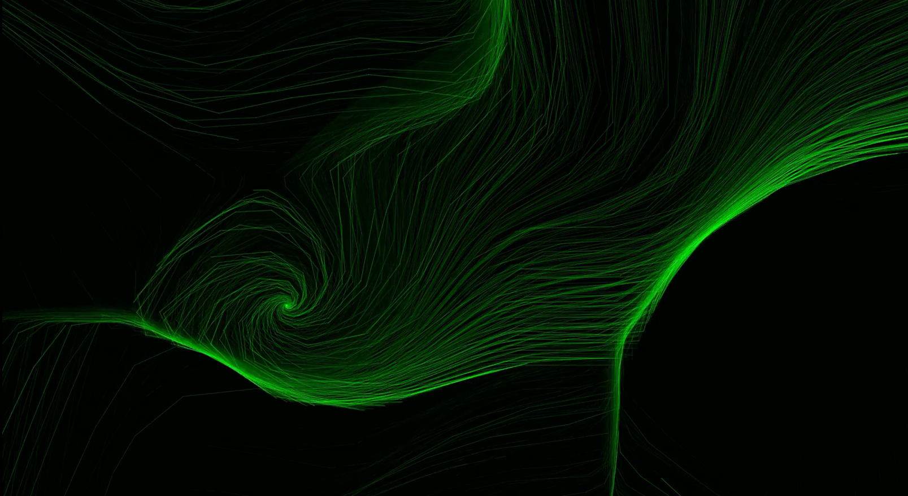](https://youtu.be/NL8bShEmRKE)|

## Conference Photos

|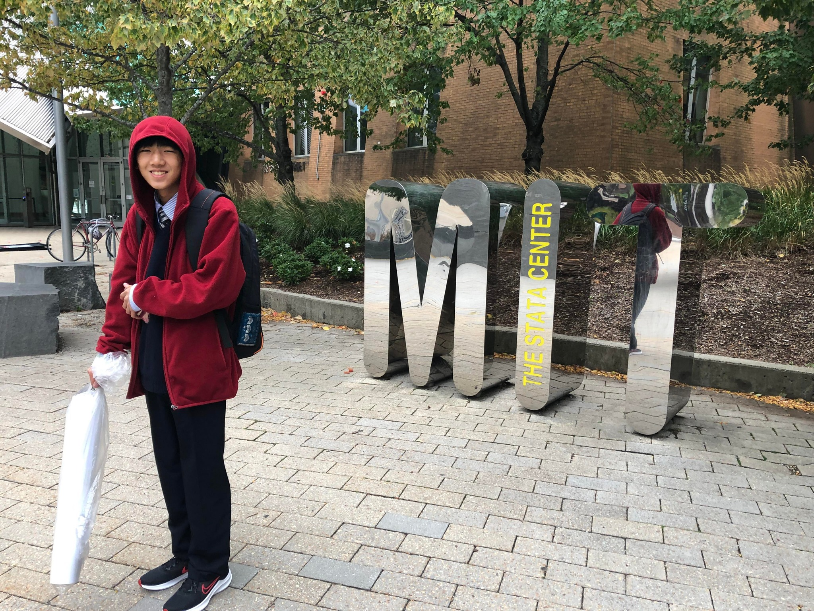  |  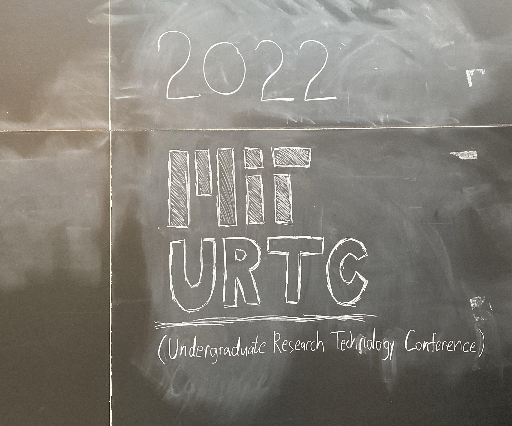| 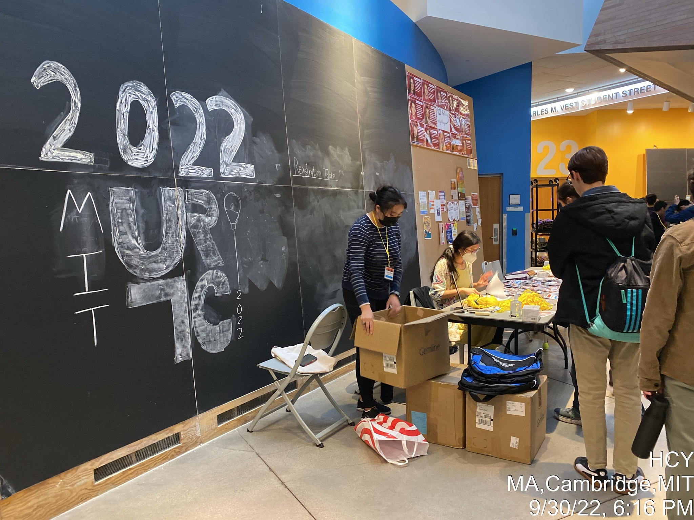|
|-|-|-|
|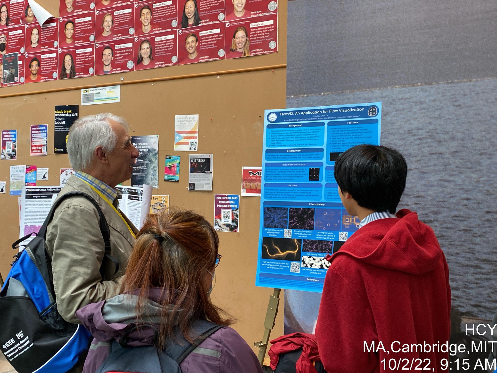  |  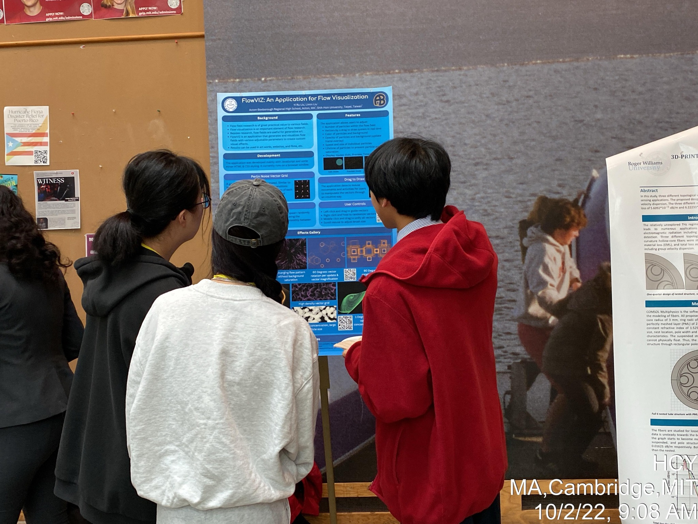| 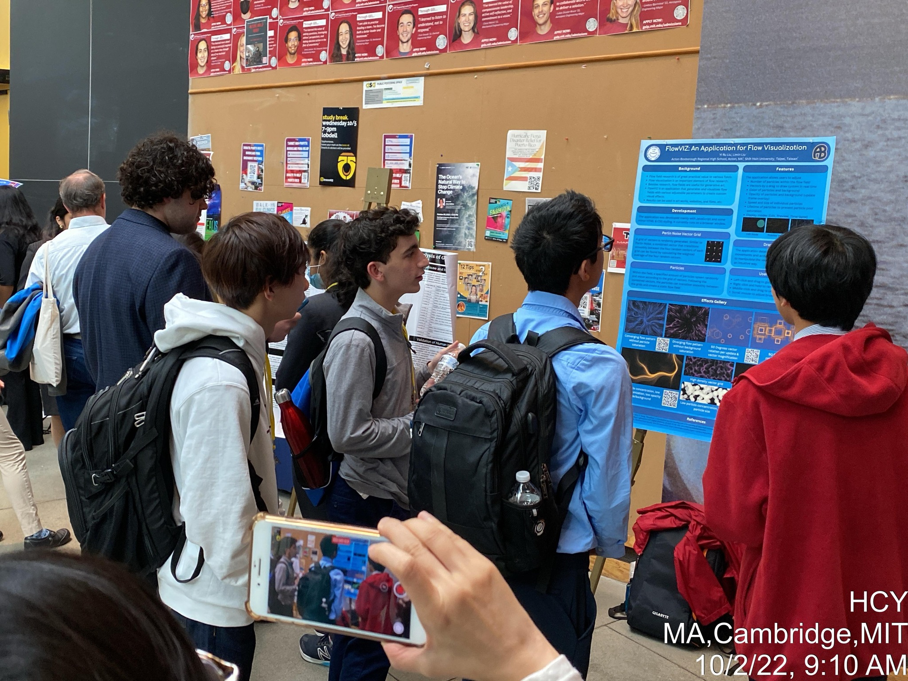|
|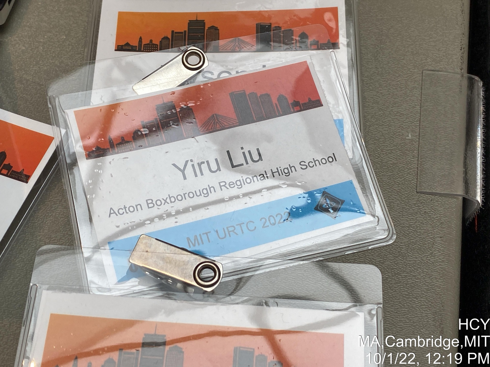  |  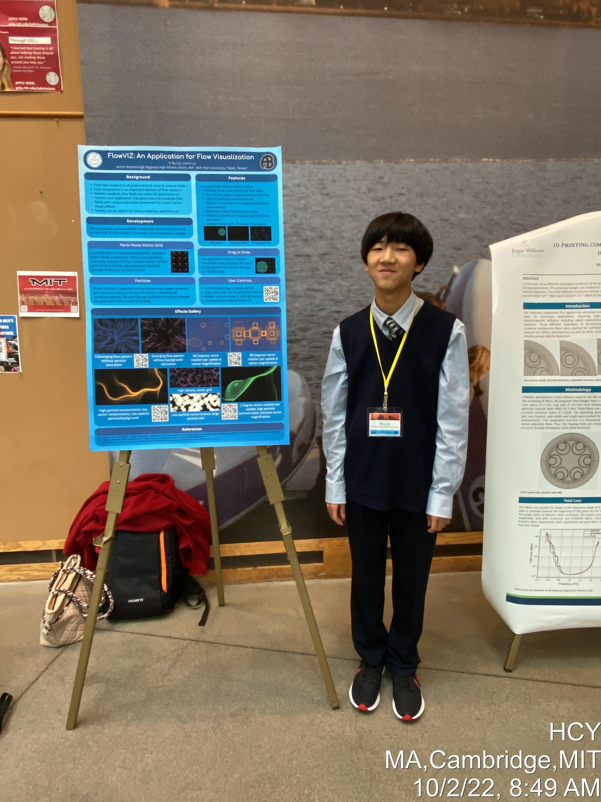| 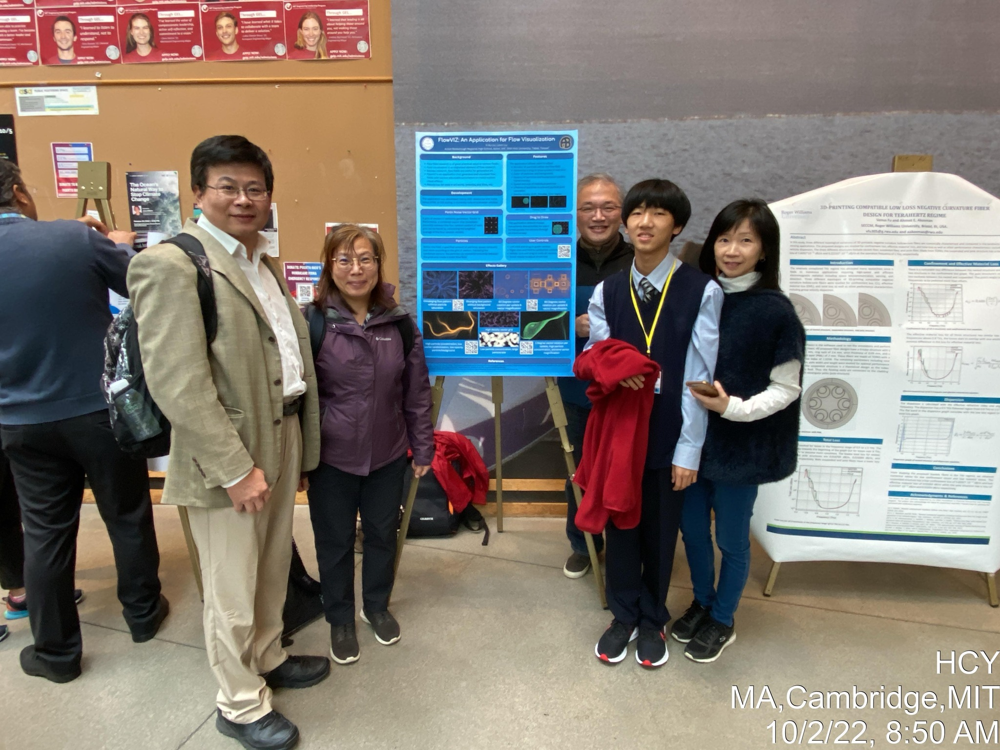|
